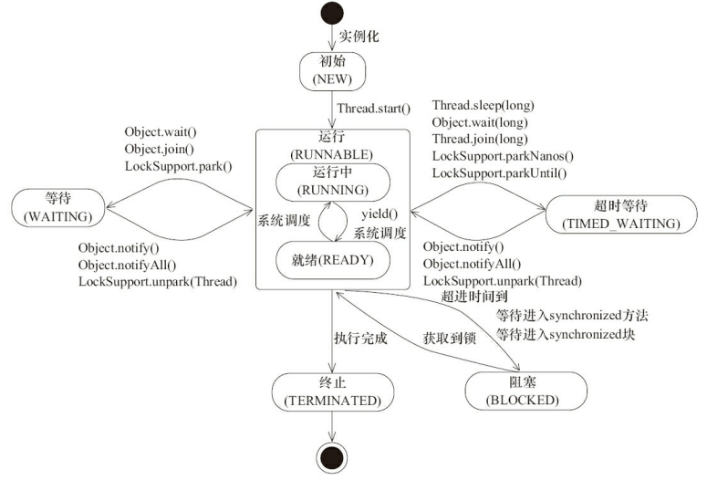

# JavaConcurrency
Java并发编程学习相关，主要跟着项目驱动学习并发编程

## 1.线程跟进程？<b/> 
线程是操作系统能够进行运算调度的最小单位，它是进程的子集，是进程中的实际运作单位 
一个进程可以有很多线程。每个进程都有自己的内存空间，是个实体，可执行代码和唯一进程标识符（PID）。  
适当使用多线程可以提高运算效率，线程可以异步执行 
## 2.用户线程和守护线程的区别 
守护线程依赖于创建它的线程，而用户线程则不依赖。举个简单的例子： 
如果在main线程中创建了一个守护线程，当main方法运行完毕之后， 
守护线程也会随着消亡。而用户线程则不会，用户线程会一直运行直到其运行完毕。 
在JVM中，像垃圾收集器线程就是守护线程 
## 3.实现多线程的方法 
a.继承Thread类； 
b.实现Runnable接口； 
c.实现Callable接口通过FutureTask包装器来创建Thread线程；  
Thread也是Runna的实现类 
Runnable就相当于一个作业，而Thread才是真正的处理线程，我们需要的只是定义这个作业， 
然后将作业交给线程去处理，这样就达到了松耦合，也符合面向对象里面组合的使用，另外也 
节省了函数开销，继承Thread的同时，不仅拥有了作业的方法run()，还继承了其他所有的方法 
start()方法被用来启动新创建的线程，start()内部调用了run()方法 
## 4.线程的状态 
  
   
   
## 5.线程调度
wait()：使一个线程处于等待（阻塞）状态，并且释放所持有的对象的锁；
sleep()：使一个正在运行的线程处于睡眠状态，是一个静态方法，调用此方法要处理 
InterruptedException异常； 
notify()：唤醒一个处于等待状态的线程，当然在调用此方法的时候，并不能确切的唤醒 
某一个等待状态的线程，而是由JVM确定唤醒哪个线程，而且与优先级无关； 
notityAll()：唤醒所有处于等待状态的线程，该方法并不是将对象的锁给所有线程， 
而是让它们竞争，只有获得锁的线程才能进入就绪状态； 
sleep来自Thread类，和wait来自Object类 
一般采用时间片优先级调度算法 
## 6.synchronized和Lock 

synchronized关键字 表示对某个对象加锁 既有可见性 又有原子性 
读写都应该加锁  不然可能会出现脏读  但是会影响性能 
一个同步方法可以调用另一个同步方法,一个线程已经拥有某个对象的锁 
再次申请的时候仍然会得到该对象的锁,也就是说synchronized获得的锁是 
可重入的(线程可以进入任何一个它已经拥有的锁所同步着的代码块) 
主要相同点：Lock能完成Synchronized所实现的所有功能。
主要不同点：Lock有比Synchronized更精确的线程予以和更好的性能。 
Synchronized会自动释放锁，但是Lock一定要求程序员手工释放，并且必须在finally从句中释放。br>
## 7.synchronized和volatile 
volatile修饰的是变量 synchronized修饰的是类和方法 
volatile 关键字，使一个变量在多个线程间可见 volatile并不能保证多个线程 
共同修改running变量时所带来的不一致问题，也就是说volatile不能替代synchronized 
volatile是一种稍弱的同步机制 用来确保将变量的更新操作通知到其他线程 
访问volatile变量时不会执行加锁操作，因此也不会使执行线程阻塞， 
volatile变量是一种比synchronized关键字更轻量级的同步机制 
加锁机制既可以确保可见性又可以确保原子性，而volatile变量只能确保可见性 

## 8.什么是线程安全？举例说明 
如果每次运行结果和单线程运行结果一样，而且其他变量结果的值和预期效果也是一样的
就是线程安全的 
ArrayList和Vector有什么区别？HashMap和HashTable有什么区别？StringBuilder和 
StringBuffer有什么区别？这些都是Java面试中常见的基础问题。面对这样的问题，回答是： 
ArrayList是非线程安全的，Vector是线程安全的；HashMap是非线程安全的，HashTable 
是线程安全的；StringBuilder是非线程安全的，StringBuffer是线程安全的 
## 9.并发与并行 

并发： 同一时间段，多个任务都在执行 (单位时间内不一定同时执行)； 
并行： 单位时间内，多个任务同时执行。 
## 10.如何停止一个线程？ 
1、通过修改共享变量来通知目标线程停止运行 
2、通过Thread.interrupt方法中断线程 
3、不提倡的stop()方法 
## 11.出现异常之锁 
 程序在执行的过程中，如果出现异常，默认情况锁会被释放 所以，在并发处理的过程中，
 有异常要多加小心，不然可能会发生不一致的情况  比如在一个web app处理过程中，
 多个servlet线程共同访问同一个资源，这时异常情况处理不合适，在一个线程中抛出异常，
 其他线程就会进入同步代码区，有可能会访问到异常产生时数据。因此要非常小心的处理同步业务逻辑中的异常

           
           